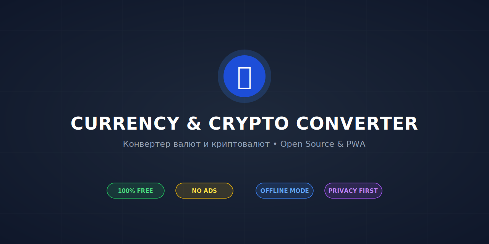
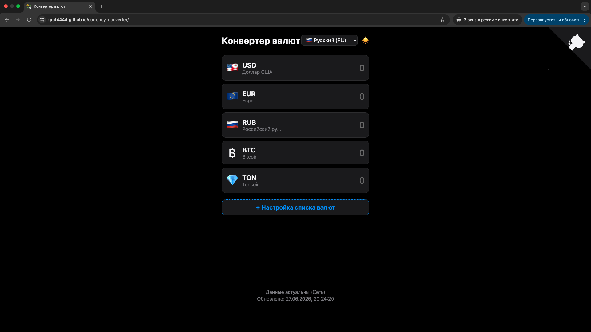
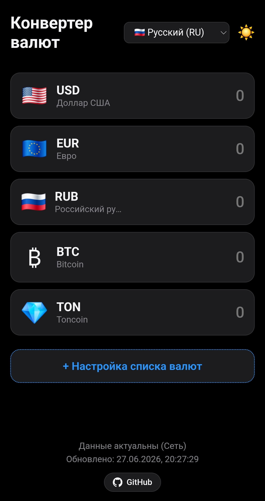

# 💱 Currency & Cryptocurrency Converter / Конвертер валют и криптовалют

  

[🇬🇧 English Version](#-english) | [🇷🇺 Русская версия](#-русская-версия)

  
  
  

---

## 🇬🇧 English

A modern, fast, and lightweight **Open Source** web tool for converting world currencies and popular cryptocurrencies. It works instantly as a regular website in any browser, but can also be installed as a full-featured application on any device (iOS, Android, Windows, macOS) — with no app stores required.

⭐ **If you like this project, please support it by giving it a star! It motivates me to add new features.**

---

### 🌍 Live Demo
The application is deployed and ready to use:
👉 **[Open Currency Converter](https://graf4444.github.io/currency-converter/)**

  <b>💻 Desktop Version</b> 
    
  <b>📱 Mobile Version</b> 
  

---

### ✨ Key Features
* **🎯 True Multi-Platform:** Use it as a website or install it directly onto your smartphone, tablet, or PC home screen as a standalone app (PWA).
* **🔓 100% Open Source & Free:** The source code is completely open, transparent, and free under the MIT license. No hidden tracks or paywalls.
* **🛡️ Privacy Focused:** No analytics, no cookies, and zero trackers. Your input and financial data never leave your device.
* **💸 No Ads & No Registration:** Start using it instantly without creating accounts or sharing your personal data.
* **📶 Full Offline Mode:** Lost your internet connection? The app keeps working seamlessly using cached exchange rates.
* **🧠 Smart Memory:** Automatically saves your favorite currency layout, custom order, and preferred theme (Light/Dark).

---

### 🌐 Supported Languages
The interface is professionally localized into **13 global languages**:

| | | | |
| :--- | :--- | :--- | :--- |
| 🇺🇸 **English** | 🇷🇺 **Русский** | 🇩🇪 **Deutsch** | 🇫🇷 **Français** |
| 🇪🇸 **Español** | 🇮🇹 **Italiano** | 🇵🇹 **Português** | 🇹🇷 **Türkçe** |
| 🇨🇳 **简体中文** | 🇯🇵 **日本語** | 🇰🇷 **한국어** | 🇮🇳 **हिन्दी** |
| 🇦🇪 **العربية** | | | |

---

### ⚙️ How it Works (Application Logic)
To ensure the app starts instantly and saves your internet traffic and battery, it uses smart automation:
* **Instant Start (Caching):** When opened, the app doesn't make you wait. It instantly loads the last known exchange rates from your device's local memory.
* **Smart Updates (Hourly):** The app values your mobile data. It only requests new data from servers if more than **1 hour** has passed since the last successful update.
* **Offline Independence:** If you lose connection or put your phone in airplane mode, the app continues to work perfectly using the cached rates. 
* **Fallback Stability:** If one data provider goes down, the app won't crash. It automatically loops through backup sources to fetch the latest data.

---

### 📊 Data Sources
The app fetches mid-market interbank exchange rates from official open-source financial providers:
* **Fiat Currencies:**
  1. **`exchangerate.fun` (Primary):** Collects current interbank quotes. Updated **every hour** for maximum precision.
  2. **`api.frankfurter.app` (Backup 1):** A reliable node displaying official European Central Bank (ECB) data. Updated daily.
  3. **`open.er-api.com` (Backup 2):** A stable global exchange rate provider. Updated once a day.
* **Cryptocurrencies:**
  * **`CoinGecko API`:** The world's largest independent crypto data aggregator, used to fetch accurate real-time prices for BTC and other digital assets.

---

### 📲 How to Install on Your Device
You don't need to download anything from app stores. Just follow these simple steps:
1. Open the [Live Demo Link](https://graf4444.github.io/currency-converter/) in your browser.
2. **On Mobile (iOS/Android):** Tap the **"Share"** or **"Menu"** button and select **"Add to Home Screen"**.
3. **On PC (Chrome/Edge):** Click the **install icon** in the address bar (on the right side).

---

### 🛠 Contribution
If you find a bug, have an idea, or want to add a feature:
* Feel free to open an [Issue](https://github.com/graf4444/currency-converter/issues).
* Create a fork and submit a [Pull Request](https://github.com/graf4444/currency-converter/pulls).

---

### 📢 Share Project

---

## 🇷🇺 Русская версия

Современный, быстрый и легкий веб-инструмент с **открытым исходным кодом (Open Source)** для конвертации мировых валют и популярных криптовалют. Он мгновенно работает как обычный сайт в любом браузере, а также может быть установлен как полноценное приложение на любое устройство (iOS, Android, Windows, macOS) — без скачивания из магазинов приложений.

⭐ **Если вам понравился проект, пожалуйста, поддержите его звездой! Это мотивирует меня добавлять новые фичи.**

---

### 🌍 Онлайн демо
Проект уже развернут и доступен для использования:
👉 **[Открыть Конвертер Валют](https://graf4444.github.io/currency-converter/)**

  <b>💻 Версия для ПК</b> 
    
  <b>📱 Мобильная версия</b> 
  

---

### ✨ Преимущества
* **🎯 Настоящая кроссплатформенность:** Используйте как сайт или установите на главный экран смартфона, планшета или рабочий стол ПК как независимое приложение (PWA).
* **🔓 100% Open Source и бесплатно:** Прозрачный открытый код под лицензией MIT. Никаких скрытых подписок, встроенных покупок или платных функций.
* **🛡️ Полная конфиденциальность:** Никаких счетчиков аналитики, трекеров или куки. Все ваши расчеты происходят строго на вашем устройстве.
* **💸 Без рекламы и регистрации:** Только чистая конвертация и удобный интерфейс без назойливых баннеров или необходимости создавать аккаунт.
* **📶 Оффлайн-режим:** Если пропал интернет или вы находитесь в полете, приложение продолжит полноценно работать на основе закэшированных курсов.
* **🧠 Умное сохранение:** Автоматически запоминает выбранные вами валюты, их порядок на экране и настройки темы (Светлая/Тёмная).

---

### 🌐 Поддерживаемые языки
Интерфейс полностью переведен и готов к работе на **13 языках**:

| | | | |
| :--- | :--- | :--- | :--- |
| 🇷🇺 **Русский** | 🇺🇸 **English** | 🇩🇪 **Deutsch** | 🇫🇷 **Français** |
| 🇪🇸 **Español** | 🇮🇹 **Italiano** | 🇵🇹 **Português** | 🇹🇷 **Türkçe** |
| 🇨🇳 **简体中文** | 🇯🇵 **日本語** | 🇰🇷 **한국어** | 🇮🇳 **हिन्दी** |
| 🇦🇪 **العربية** | | | |

---

### ⚙️ Как это работает (Логика приложения)
Чтобы приложение работало мгновенно, не тратило мобильный трафик и заряд батареи, в него заложена автоматическая логика:
* **Мгновенный запуск (Кэширование):** Приложение не заставляет вас ждать загрузки. Оно сразу берет последние известные курсы из локальной памяти устройства.
* **Умное обновление (Раз в час):** Сетевой запрос к серверам происходит только в том случае, если с момента последнего успешного обновления прошло **более 1 часа**.
* **Автономность (Офлайн-режим):** Если у вас пропал интернет, приложение продолжит полноценно работать на основе сохраненного кэша.
* **Защита от сбоев (Каскадность):** Если один из финансовых серверов временно недоступен, приложение автоматически и незаметно для вас переключится на резервные источники.

---

### 📊 Источники данных
Приложение запрашивает официальные мировые котировки (среднерыночные межбанковские курсы) из открытых источников высокой точности:
* **Фиатные (обычные) валюты:**
  1. **`exchangerate.fun` (Основной):** собирает актуальные данные межбанковского рынка. Обновляется **каждый час**, обеспечивая высокую актуальность.
  2. **`api.frankfurter.app` (Резервный 1):** надёжный источник, предоставляющий официальные данные Европейского центрального банка (ЕЦБ). Обновляется раз в сутки.
  3. **`open.er-api.com` (Резервный 2):** стабильный международный провайдер валютных курсов. Обновляется раз в день.
* **Криптовалюты:**
  * **`CoinGecko API`:** крупнейший мировой независимый агрегатор данных о криптовалютах. Используется для получения точных цен биткоина и других монет в реальном времени.

---

### 📲 Как установить приложение на устройство
Вам не нужно искать приложение в App Store или Google Play. Всё гораздо проще:
1. Перейдите по [ссылке на сайт проекта](https://graf4444.github.io/currency-converter/).
2. **На телефоне (iOS/Android):** Нажмите кнопку **«Поделиться»** или **«Меню»** в браузере и выберите **«Добавить на главный экран»**.
3. **На ПК (Chrome/Edge):** Нажмите на **иконку установки** в правой части адресной строки.

---

### 🛠 Разработка и вклад (Contribution)
Если вы нашли ошибку или хотите предложить улучшение:
* Создайте [Issue (Задачу)](https://github.com/graf4444/currency-converter/issues).
* Сделайте форк репозитория и отправьте [Pull Request](https://github.com/graf4444/currency-converter/pulls).

---

### 📢 Поделиться проектом

